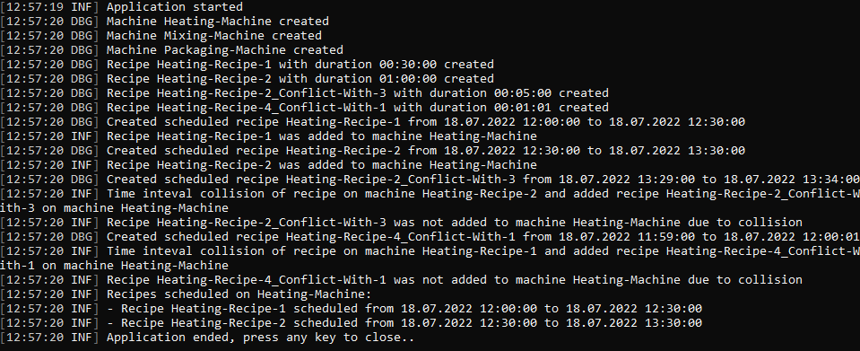

# machine-recipe-scheduling

Small console application for code interview written in .NET 5

The purpose is to design system that is able to schedule Recipes on Machines

Dependencies 
- Serilog (logging nuget package)

## Main program output

## How does it work

- Recipe has a name and duration
- Machine has a name
- Machine can schedule recipe to concrete datetime - it becomes ScheduledRecipe with fixed scheduled time interval 
- Machine cannot have recipes overlapping in time
- Machine provides all recipes scheduled on it

See program.cs in Scheduling for more intuition
